# Yazamuk - Technical Design Document (MVP)

## 1. Project Overview
**Yazamuk** is a fintech gifting platform that allows users to gift fractional US stocks (like Tesla, Apple) to friends using cash. The recipient receives a link, goes through a simplified onboarding process, and the system automatically purchases the stock for them using the Alpaca Broker API.

### Core Value Proposition
* **Sender:** Pays cash (USD) to gift a stock value (e.g., "$100 of TSLA").
* **Receiver:** Receives a seamless onboarding experience and owns the actual asset upon completion.
* **Model:** "Dollar-Based Gifting" (Cash held in firm account until redemption -> Journal to user -> Buy Order).

---

## 2. Architecture

### High-Level Flow
The system acts as an orchestrator between the users and the Alpaca Broker API. It manages the state of the gift until the recipient is ready to own the account.

```mermaid
sequenceDiagram
    autonumber
    participant Buyer as 🎁 Sender
    participant Receiver as 👤 Receiver
    participant App as 💻 Next.js Client
    participant API as ⚙️ Backend (API Route)
    participant DB as 🗄️ SQLite DB
    participant Alpaca as 🦙 Alpaca API

    Note over Buyer, DB: Phase 1: Purchasing the Gift
    Buyer->>App: Selects Stock ($100 TSLA) & Pays
    App->>DB: Create Gift Record (Status: PENDING)
    DB-->>App: Returns Gift ID
    App-->>Buyer: Displays Shareable Link

    Note over Receiver, Alpaca: Phase 2: Claiming the Gift
    Receiver->>App: Opens Link (/claim/[id])
    App->>DB: Fetches Gift Details
    App-->>Receiver: Displays "You got $100 of TSLA!"
    Receiver->>App: Submits Onboarding Form (KYC)
    App->>API: POST /api/claim-gift

    Note over API,Alpaca: Critical Backend Sequence
    rect rgb(100, 120, 150)
        API->>Alpaca: 1. Create Account (POST /accounts)
        Alpaca-->>API: Account ID (Status: SUBMITTED)
        
        loop Polling (Every 2s)
            API->>Alpaca: 2. Check Status
            Alpaca-->>API: Status: ACTIVE
        end

        API->>Alpaca: 3. Journal Cash (Firm -> User)
        Alpaca-->>API: Success (JNLC)

        API->>Alpaca: 4. Buy Order (Notional $100)
        Alpaca-->>API: Order Filled
    end

    API->>DB: Update Gift Status (CLAIMED)
    API-->>App: Return Success
    App-->>Receiver: Show Success/Confetti Screen
```



---

## 3. Tech Stack
* **Framework:** Next.js 14 (App Router)
* **Language:** TypeScript
* **Styling:** Tailwind CSS (Neon/Dark Mode Theme)
* **Database:** SQLite (Local file for MVP) with Prisma ORM
* **External API:** Alpaca Broker API (Sandbox Environment)
* **HTTP Client:** Axios

---

## 4. Data Models (Schema)

### Table: `Gift`
Stores the metadata of the gift transaction.

| Field | Type | Description |
| :--- | :--- | :--- |
| `id` | `String` (UUID) | Primary Key. Used in the claim URL. |
| `senderName` | `String` | Name of the person sending the gift. |
| `receiverName` | `String` | Name of the intended recipient. |
| `receiverEmail` | `String` | Email of the recipient. |
| `amount` | `Float` | The dollar amount gifted (e.g., 100.00). |
| `stockSymbol` | `String` | The ticker symbol (e.g., "TSLA"). |
| `status` | `Enum` | `PENDING`, `CLAIMED` |
| `alpacaAccountId`| `String` | (Optional) Stores the Receiver's Alpaca ID after claim. |
| `createdAt` | `DateTime` | Timestamp of purchase. |

---

## 5. API Implementation Details

### Route: `POST /api/claim-gift`
This is the core logic function. It must handle the synchronous chain of events required to finalize the gift.

#### Input Payload:
```json
{
  "giftId": "uuid-string",
  "firstName": "Danny",
  "lastName": "Receiver",
  "email": "danny@example.com",
  "dob": "1990-01-01",
  "taxId": "000-00-0000",
  "address": { ... }
}
```

#### Execution Logic:
1.  **Validate Gift:** Check DB if `giftId` exists and `status` is `PENDING`.
2.  **Step A - Create Account:** * Call `POST /v1/accounts` to Alpaca.
    * Map user PII (Personally Identifiable Information) to Alpaca's JSON structure.
3.  **Step B - Poll for Activation:** * The account is created in `SUBMITTED` state.
    * Implement a loop checking `GET /v1/accounts/{id}` every 2 seconds.
    * **Break condition:** Status becomes `ACTIVE` (or timeout after 30s).
4.  **Step C - Fund Account (Journal):**
    * Call `POST /v1/journals`.
    * `from_account`: `process.env.FIRM_ACCOUNT_ID`
    * `to_account`: New User Account ID.
    * `entry_type`: `"JNLC"` (Cash Journal).
    * `amount`: `gift.amount` (as string).
5.  **Step D - Execute Trade:**
    * Call `POST /v1/orders`.
    * `symbol`: `gift.stockSymbol`.
    * `notional`: `gift.amount` (Buy by dollar amount).
    * `side`: `"buy"`.
    * `type`: `"market"`.
6.  **Finalize:** Update DB `status` to `CLAIMED` and return success to frontend.

---

## 6. Environment Variables (`.env.local`)

Required configuration for the connection to Alpaca Sandbox.

```bash
# Alpaca API Credentials (Sandbox)
ALPACA_API_KEY="<Your-Key-ID>"
ALPACA_SECRET_KEY="<Your-Secret-Key>"
ALPACA_BASE_URL="[https://broker-api.sandbox.alpaca.markets/v1](https://broker-api.sandbox.alpaca.markets/v1)"

# The Master Account holding the funds
FIRM_ACCOUNT_ID="aa43c0fa-f9dd-3f61-8257-e8fe062a6899"

# Database
DATABASE_URL="file:./dev.db"
```

## 7. UI/UX Guidelines
* **Theme:** Dark mode, high contrast.
* **Vibe:** Modern, "Fintech for Gen Z", Neon accents.
* **Stock Selector:** Visual cards with logos for TSLA, AAPL, NVDA.
* **Feedback:** Show loading spinners during the "Claiming..." process (as the backend performs multiple API calls).